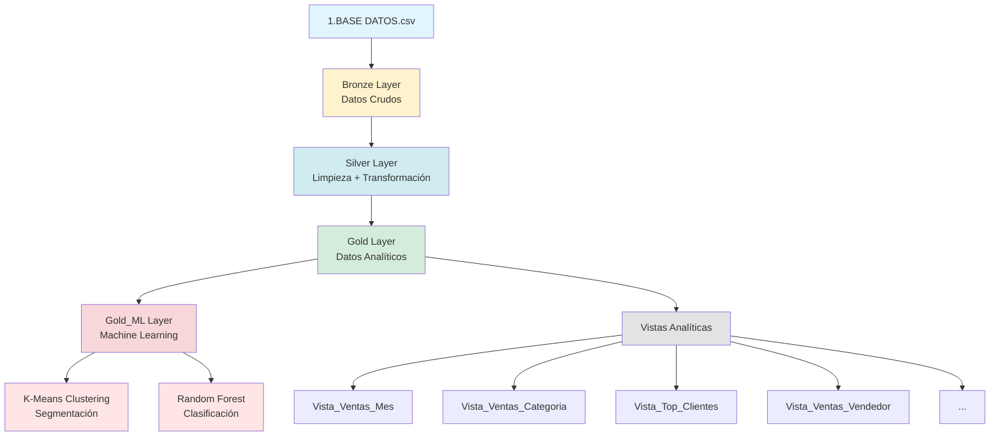

# Proyecto Minería de Datos

Pipeline ETL con arquitectura Medallion para análisis de ventas usando SQL Server y Machine Learning.

## Arquitectura

```
CSV → Bronze (Raw) → Silver (Clean) → Gold (Analytics) → Gold_ML (ML Models)
```

**Capas:**
- **Bronze**: Datos crudos sin transformar
- **Silver**: Limpieza, deduplicación y cálculo de márgenes
- **Gold**: Datos analíticos con dimensiones temporales
- **Gold_ML**: K-Means clustering y Random Forest clasificación

## Requisitos

- Python 3.8+
- SQL Server 2019+
- Docker (opcional)

## Instalación

```bash
cd src
pip install -r requirements.txt
```

## Configuración

Crear archivo `.env` en la raíz:

```env
MSSQL_HOST=localhost
MSSQL_PORT=1433
MSSQL_DATABASE=ProyectoFinalMineraDatos
MSSQL_USER=sa
MSSQL_PASSWORD=tu_password
```

## Uso

**Local:**
```bash
cd src
python proyecto_mineria.py
```

**Docker:**
```bash
docker-compose up -d
```

## Estructura del Proyecto

```
mineria_datos/
├── data/                         # Datos y SQL
│   ├── 1.BASE DATOS.csv
│   ├── vistas_analiticas.sql
│   └── proyecto_mineria_log.txt
├── src/                          # Código fuente
│   ├── proyecto_mineria.py
│   ├── requirements.txt
│   └── Dockerfile
├── docker-compose.yml
├── .env
└── README.md
```

## Tablas Generadas

| Tabla | Descripción |
|-------|-------------|
| `Bronze` | ~850k registros crudos |
| `Silver` | Datos limpios + márgenes calculados |
| `Gold` | Datos analíticos + dimensiones temporales |
| `Gold_ML_Metricas` | Resultados de modelos ML |

## Vistas Analíticas

- `Vista_Ventas_Mes` - Agregación mensual
- `Vista_Ventas_Categoria` - Por categoría de producto
- `Vista_Ventas_Sucursal` - Por sucursal
- `Vista_Top_Clientes` - Ranking de clientes
- `Vista_Ventas_Linea` - Por línea de producto
- `Vista_Ventas_Vendedor` - Desempeño de vendedores
- `Vista_Ventas_Trimestre` - Agregación trimestral
- `Vista_Ventas_DiaSemana` - Patrón semanal

## Machine Learning

**K-Means Clustering (k=3):**
- Segmentación de clientes por Venta, Margen y Cantidad
- Métrica: Silhouette Score

**Random Forest:**
- Clasificación de tipo de cliente
- Features: Venta, Margen, Cantidad, Mes, Día de semana
- Métrica: Accuracy

## Diagrama de Arquitectura



## Logs

El proceso genera `proyecto_mineria_log.txt` con:
- Registros procesados en cada capa
- Métricas de limpieza
- Resultados de ML
- Errores y warnings

## Autor

Proyecto Final - Minería de Datos
